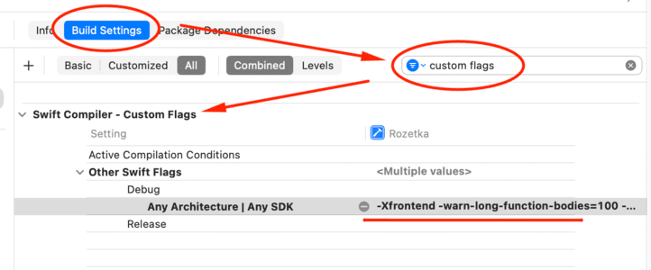

# Compile time. Functions and Expressions

Should add flags here:
- Open Project setting 
- Build Settings
- Swift Compiler 
- Custom Flags 
- Other Swift Flags



Add this flags to debug configuration, where **limit** set to ms of lower accessible compile time
``` console
-Xfrontend -warn-long-function-bodies=limit
-Xfrontend -warn-long-expression-type-checking=limit
```
Better insert it as a single line, as in example:
``` console
-Xfrontend -warn-long-function-bodies=100 -Xfrontend -warn-long-expression-type-checking=100
```
As a result you will see in Issue Navigator you will see such warnings:
``` console 
Instance method '_content()' took 125ms to type-check (limit: 100ms)
```
You can solve solid compile issues and then reduce limit to solve minor issues.