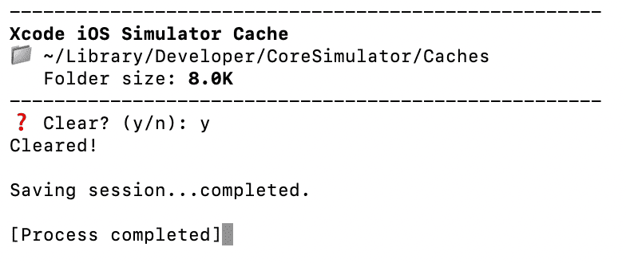

# Simulator Cache in Xcode. Size and Cleanup

This guide explains how to inspect and clear the Xcode iOS Simulator cache, which can grow large over time and affect disk usage. It targets the folder  `~/Library/Developer/CoreSimulator/Caches`.

## 📦 Check Cache Size

To see how much space the simulator cache is using:

```bash
du -sh ~/Library/Developer/CoreSimulator/Caches
```
This command outputs the total size of the cache directory in a human-readable format (KB/MB/GB).

## **🧹 Clean Cache**

To safely remove cached simulator data (Xcode will recreate it when needed):
```bash
rm -rf ~/Library/Developer/CoreSimulator/Caches/*
```

## 🛠️ Build Swift Script into Executable

A prepared Swift file is used to automate cache cleanup:

[core-simulator-caches-cleanup.swift](core-simulator-caches-cleanup.swift)

This script can be compiled into a standalone executable using the Swift compiler.

### 🔧 Compile

Use `swiftc` to convert the `.swift` file into a native binary:

```bash
swiftc core-simulator-caches-cleanup.swift -o core-simulator-caches-cleanup
```

## 
> 