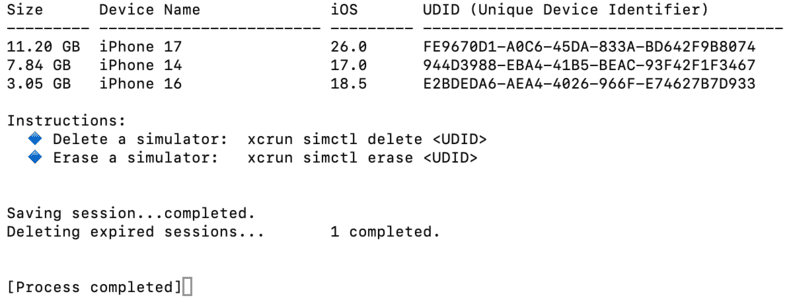

# Simulators list with size.

A macOS command-line tool that scans `~/Library/Developer/CoreSimulator/Devices`, finds all simulators larger than 100 MB, and prints them sorted by size in a formatted table showing size, device name, iOS version, and UDID — with instructions for deleting or erasing them via `xcrun simctl`.

## 🛠️ Build Swift Script into Executable

A prepared Swift file is used to automate cache cleanup:

[simulators-list-with-size.swift](simulators-list-with-size.swift)

This script can be compiled into a standalone executable using the Swift compiler.

### 🔧 Compile

Use `swiftc` to convert the `.swift` file into a native binary:

```bash
swiftc simulators-list-with-size.swift -o simulators-list-with-size
```

## 
> 